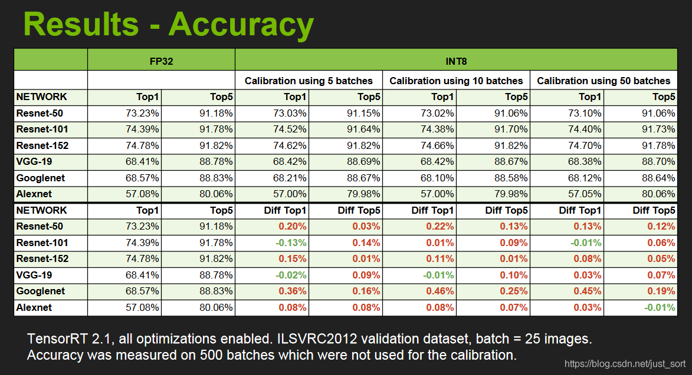

# Tensorrt介绍、安装及使用
## 1、介绍 
TensorRT 是 NVIDIA 推出的一个高性能的深度学习推理框架，可以让深度学习模型在 NVIDIA GPU 上实现低延迟，高吞吐量的部署。TensorRT 支持 Caffe，TensorFlow，Mxnet，Pytorch 等主流深度学习框架。TensorRT 是一个 C++ 库，并且提供了 C++ API 和 Python API，主要在 NVIDIA GPU 进行高性能的推理 (Inference) 加速。

当前，TensorRT6.0 已经支持了很多深度学习框架如 Caffe/TensorFlow/Pytorch/MxNet。对于 Caffe 和 TensorFlow 的网络模型解析，然后与 TensorRT 中对应的层进行一一映射，然后 TensorRT 可以针对 NVIDIA 的 GPU 进行优化并进行部署加速。不过，对于 Caffe2，Pytorch，MxNet，Chainer，CNTK 等深度学习框架训练的模型都必须先转为 ONNX 的通用深度学习模型，然后对 ONNX 模型做解析。另外 TensorFlow/MxNet/MATLAB 都已经将 TensorRT 集成到框架中去了。
> ONNX 是一种针对机器学习所设计的开放式的文件格式，用于存储训练好的模型。它使得不同的人工智能框架（如 Pytorch, MXNet）可以采用相同格式存储模型数据并交互。 ONNX 的规范及代码主要由微软，亚马逊 ，Facebook 和 IBM 等公司共同开发，以开放源代码的方式托管在 Github 上。目前官方支持加载 ONNX 模型并进行推理的深度学习框架有： Caffe2, PyTorch, MXNet，ML.NET，TensorRT 和 Microsoft CNTK，并且 TensorFlow 也非官方的支持 ONNX。--- 维基百科
> 

ONNX/TensorFlow/Custom Framework 等模型的工作方式如下：

## 2、TensorRT 支持的 Layer
https://github.com/NVIDIA/TensorRT
https://developer.nvidia.com/tensorrt
## 3、为什么 TensorRT 能让模型跑的快？
这一问题的答案就隐藏下面这张图中：

从图上可以看到，TensorRT 主要做了下面几件事，来提升模型的运行速度。

TensorRT 支持 FP16 和 INT8 的计算。我们知道深度学习在训练的时候一般是应用 32 位或者 16 位数据，TensorRT 在推理的时候可以降低模型参数的位宽来进行低精度推理，以达到加速推断的目的。这在后面的文章中是重点内容，笔者经过一周的研究，大概明白了 TensorRT INT8 量化的一些细节，后面会逐渐和大家一起分享讨论。
TensorRT 对于网络结构进行重构，把一些能够合并的运算合并在了一起，针对 GPU 的特性做了优化。大家如果了解 GPU 的话会知道，在 GPU 上跑的函数叫 Kernel，TensorRT 是存在 Kernel 的调用的。在绝大部分框架中，比如一个卷积层、一个偏置层和一个 reload 层，这三层是需要调用三次 cuDNN 对应的 API，但实际上这三层的实现完全是可以合并到一起的，TensorRT 会对一些可以合并网络进行合并；再比如说，目前的网络一方面越来越深，另一方面越来越宽，可能并行做若干个相同大小的卷积，这些卷积计算其实也是可以合并到一起来做的。(加粗的话转载自参考链接 1)。
然后 Concat 层是可以去掉的，因为 TensorRT 完全可以实现直接接到需要的地方。
Kernel Auto-Tuning：网络模型在推理计算时，是调用 GPU 的 CUDA 核进行计算的。TensorRT 可以针对不同的算法，不同的网络模型，不同的 GPU 平台，进行 CUDA 核的调整，以保证当前模型在特定平台上以最优性能计算。
Dynamic Tensor Memory 在每个 tensor 的使用期间，TensorRT 会为其指定显存，避免显存重复申请，减少内存占用和提高重复使用效率。
不同的硬件如 P4 卡还是 V100 卡甚至是嵌入式设备的卡，TensorRT 都会做优化，得到优化后的 engine。
下面是一个原始的 Inception Block，首先input后会有多个卷积，卷积完后有Bias和ReLU，结束后将结果concat到一起，得到下一个input。我们一起来看一下使用 TensorRT 后，这个原始的计算图会被优化成了什么样子。

首先，在没有经过优化的时候 Inception Block 如 Figure1 所示：

第二步，对于网络结构进行垂直整合，即将目前主流神经网络的 conv、BN、Relu 三个层融合为了一个层，所谓 CBR，合并后就成了 Figure2 中的结构。

第三步，TensorRT 还可以对网络做水平组合，水平组合是指将输入为相同张量和执行相同操作的层融合一起，下面的 Figure3 即是将三个相连的1×1 的 CBR 为一个大的1×1 的 CBR。

最后，对于 concat 层，将 contact 层的输入直接送入下面的操作中，不用单独进行 concat 后在输入计算，相当于减少了一次传输吞吐，然后就获得了如 Figure4 所示的最终计算图。

除了计算图和底层优化，最重要的就是低精度推理了，这个后面会细讲的，我们先来看一下使用了 INT8 低精度模式进行推理的结果展示：包括精度和速度。来自 NIVIDA 提供的 PPT。


## 4、TensorRT 的安装
我是用的是 TensorRT-6.0.1.5，由于我在 Windows10 上使用的，所以就去 TensorRT 官网https://developer.nvidia.com/tensorrt下载 TensorRT6 的 Windows10 安装包，这里我选择了 Cuda9.0 的包，这也就意味着我必须要安装 Cudnn7.5 及其以上，我这里选择了 Cudnn7.6 进行了安装。关于 Cuda 和 Cudnn 的安装就不说了，非常简单。安装 TensorRT 具体有以下步骤：

1. 下载 TensorRT-6.0.1.5 安装包并解压。

2. 将 lib 文件夹下面的 dll(如下图所示，) 都拷贝到 cuda 文件夹下的 bin 目录下，我是默认安装了 cuda9.0，所以我的 cuda 下的 bin 目录的路径是：C:\Program Files\NVIDIA GPU Computing Toolkit\CUDA\v9.0\bin。


3. 然后这就安装成功了。
## 5、TensorRT 使用流程
这里先看一下 TensorRT 最简单的使用流程，后面复杂的应用部署也是以这个为基础的，在使用 TensorRT 的过程中需要提供以下文件 (以 Caffe 为例)：

模型文件 (*.prototxt)
权重文件 (*.caffemodel)
标签文件 (把数据映射成 name 字符串)。
TensorRT 的使用包括两个阶段，Build和Deployment。
### 5.1 Build
Build 阶段主要完成模型转换 (从 Caffe/TensorFlow/Onnx->TensorRT)，在转换阶段会完成前面所述优化过程中的计算图融合，精度校准。这一步的输出是一个针对特定 GPU 平台和网络模型的优化过的 TensorRT 模型。这个 TensorRT 模型可以序列化的存储到磁盘或者内存中。存储到磁盘中的文件叫plan file，这个过程可以用下图来表示：

下面的代码展示了一个简单的 Build 过程。注意这里的代码注释是附录的第 2 个链接提供的，TensorRT 版本是 2.0,。然后我观察了下 TensorRT6.0 的代码，虽然接口有一些变化但 Build->Deployment 这个流程是通用，所以就转载它的代码解释来说明问题了。
```c++
//创建一个builder
IBuilder* builder = createInferBuilder(gLogger);
// parse the caffe model to populate the network, then set the outputs
// 创建一个network对象，不过这时network对象只是一个空架子
INetworkDefinition* network = builder->createNetwork();
//tensorRT提供一个高级别的API：CaffeParser，用于解析Caffe模型
//parser.parse函数接受的参数就是上面提到的文件，和network对象
//这一步之后network对象里面的参数才被填充，才具有实际的意义
CaffeParser parser;
auto blob_name_to_tensor = parser.parse(“deploy.prototxt”,
                                        trained_file.c_str(),
                                        *network,
                                        DataType::kFLOAT);
// 标记输出 tensors
// specify which tensors are outputs
network->markOutput(*blob_name_to_tensor->find("prob"));
// Build the engine
// 设置batchsize和工作空间，然后创建inference engine
builder->setMaxBatchSize(1);
builder->setMaxWorkspaceSize(1 << 30); 
//调用buildCudaEngine时才会进行前述的层间融合或精度校准优化方式
ICudaEngine* engine = builder->buildCudaEngine(*network);
//转载自 https://arleyzhang.github.io/articles/7f4b25ce/
```
在上面的代码中使用了一个高级 API：CaffeParser，直接读取 caffe 的模型文件，就可以解析，也就是填充 network 对象。解析的过程也可以直接使用一些低级别的 C++API，例如：
```c++
ITensor* in = network->addInput(“input”, DataType::kFloat, Dims3{…});
IPoolingLayer* pool = network->addPooling(in, PoolingType::kMAX, …);
//转载自 https://arleyzhang.github.io/articles/7f4b25ce/
```
解析了 Caffe 的模型之后，必须要指定输出 Tensor，设置 batch 大小和设置工作空间。其中设置工作空间是进行上面所述的计算图融合优化的必须步骤。
### 5.2 Deployment¶
Deploy 阶段就是完成前向推理过程了，上面提到的 Kernel Auto-Tuning 和 Dynamic Tensor Memory 应该是也是在这个步骤中完成的。这里将 Build 过程中获得的 plan 文件首先反序列化，并创建一个 runtime engine，然后就可以输入数据，然后输出分类向量结果或检测结果。这个过程可以用下图来表示：

下面的代码展示了一个简单的 Deploy 过程，这里没有包含反序列化和测试时的 batch 流的获取。可以看到代码还是相当复杂的，特别是包含了一些 CUDA 编程的知识。
解析，也就是填充 network 对象。解析的过程也可以直接使用一些低级别的 C++API，例如：
```c++
// The execution context is responsible for launching the 
// compute kernels 创建上下文环境 context，用于启动kernel
IExecutionContext *context = engine->createExecutionContext();
// In order to bind the buffers, we need to know the names of the 
// input and output tensors. //获取输入，输出tensor索引
int inputIndex = engine->getBindingIndex(INPUT_LAYER_NAME),
int outputIndex = engine->getBindingIndex(OUTPUT_LAYER_NAME);
//申请GPU显存
// Allocate GPU memory for Input / Output data
void* buffers = malloc(engine->getNbBindings() * sizeof(void*));
cudaMalloc(&buffers[inputIndex], batchSize * size_of_single_input);
cudaMalloc(&buffers[outputIndex], batchSize * size_of_single_output);
//使用cuda 流来管理并行计算
// Use CUDA streams to manage the concurrency of copying and executing
cudaStream_t stream;
cudaStreamCreate(&stream);
//从内存到显存，input是读入内存中的数据；buffers[inputIndex]是显存上的存储区域，用于存放输入数据
// Copy Input Data to the GPU
cudaMemcpyAsync(buffers[inputIndex], input, 
                batchSize * size_of_single_input, 
                cudaMemcpyHostToDevice, stream);
//启动cuda核计算
// Launch an instance of the GIE compute kernel
context.enqueue(batchSize, buffers, stream, nullptr);
//从显存到内存，buffers[outputIndex]是显存中的存储区，存放模型输出；output是内存中的数据
// Copy Output Data to the Host
cudaMemcpyAsync(output, buffers[outputIndex], 
                batchSize * size_of_single_output, 
                cudaMemcpyDeviceToHost, stream));
//如果使用了多个cuda流，需要同步
// It is possible to have multiple instances of the code above
// in flight on the GPU in different streams.
// The host can then sync on a given stream and use the results
cudaStreamSynchronize(stream);
```
### 5.3 TensorRT 6.0 的 Deployment
随着 TensorRT 的版本迭代，前向推理的代码变成越来越简单，基本上不需要我们操心了，我们来感受一下 Mnist 数字识别网络的推理代码。
```c++
bool SampleMNIST::infer()
{
    // Create RAII buffer manager object
    samplesCommon::BufferManager buffers(mEngine, mParams.batchSize);

    auto context = SampleUniquePtr<nvinfer1::IExecutionContext>(mEngine->createExecutionContext());
    if (!context)
    {
        return false;
    }

    // Pick a random digit to try to infer
    srand(time(NULL));
    const int digit = rand() % 10;

    // Read the input data into the managed buffers
    // There should be just 1 input tensor
    assert(mParams.inputTensorNames.size() == 1);
    if (!processInput(buffers, mParams.inputTensorNames[0], digit))
    {
        return false;
    }
    // Create CUDA stream for the execution of this inference.
    cudaStream_t stream;
    CHECK(cudaStreamCreate(&stream));

    // Asynchronously copy data from host input buffers to device input buffers
    buffers.copyInputToDeviceAsync(stream);

    // Asynchronously enqueue the inference work
    if (!context->enqueue(mParams.batchSize, buffers.getDeviceBindings().data(), stream, nullptr))
    {
        return false;
    }
    // Asynchronously copy data from device output buffers to host output buffers
    buffers.copyOutputToHostAsync(stream);

    // Wait for the work in the stream to complete
    cudaStreamSynchronize(stream);

    // Release stream
    cudaStreamDestroy(stream);

    // Check and print the output of the inference
    // There should be just one output tensor
    assert(mParams.outputTensorNames.size() == 1);
    bool outputCorrect = verifyOutput(buffers, mParams.outputTensorNames[0], digit);

    return outputCorrect;
}
```
### 6、使用了 TensorRT 的优化方式效果

### 参考
- https://blog.csdn.net/qq_33869371/article/details/87929419
- https://arleyzhang.github.io/articles/7f4b25ce/
- http://on-demand.gputechconf.com/gtc/2017/presentation/s7310-8-bit-inference-with-tensorrt.pdf