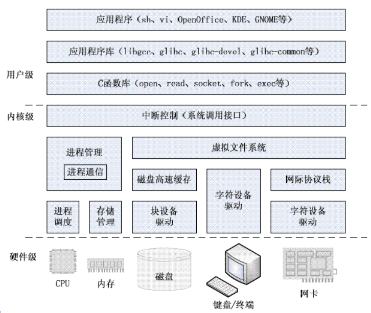
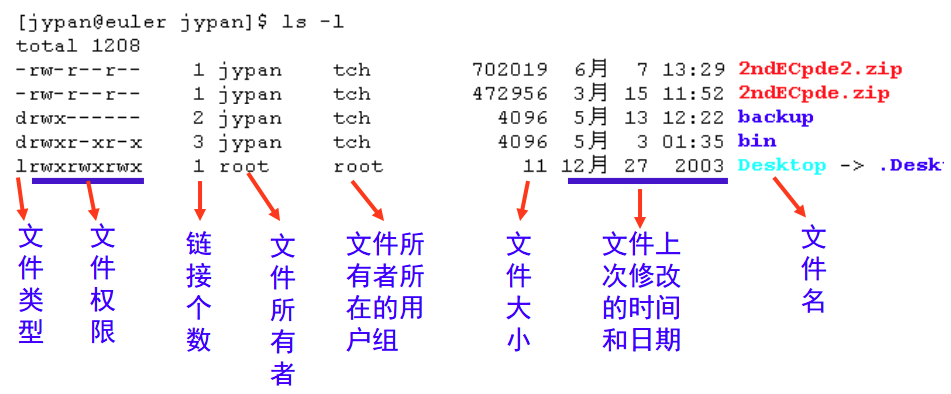

# Linux
## 概念
### linux架构
Linux 系统结构大致分为：内核、Shell、文件系统、应用程序
- 内核：运行程序和管理各种硬件设备的核心程序
- Shell：命令语言解释器，是用户与内核进行交互操作的接口
- 文件系统：文件存放在存储设备上的组织方法，如 ext4、vfs、nfs 等
- 应用软件：Linux 发行版都有一整套的应用程序集


## 基础命令
### 文件与权限
```shell
# find查找，xargs给命令传递参数(针对不能接收管道输出的命令)，grep查找字符串
find /bin/ -name "sh"|xargs ls -l
# 注意shell执行区别：sh（执行失败则停止，类似execve），bash（单个命令失败继续执行后续，类似fork）
ls /bin|grep -E "*sh"
# sed依照脚本的指令来处理、编辑文本文件，查找指定内容；nl按行格式化输出
nl a.c|sed -n '/func/p' 
# 查找可执行命令位置(which从PATH中找)，查看指定命令类型（type）,配置环境变量export（本shell周期，非永久）
which python
export PATH=$PATH:/home/bin
type echo # echo is a shell builtin
# 命令执行优先级，及对应命令、例子
先    alias --> function --> builtin --> program   后
  alias/unalias  -->  function/unset -->  builtin
alias test="ls -l"  --> function test1 { echo "hello"; } --> builtin test1
# 权限管理，配置文件/etc/passwd
chmod [who] [+|-|=] [mode] file/folder
# 软链接
ln
```


### 进程
```shell
ps
# ctrl+z挂起，ctrl+c终止
# 前后台进程命令
jobs, bg, fg, &
# 监控用户空间进程和内核的交互
strace -tt -T -v -f -e trace=file -o strace.log -s 1024 -p 23489
# 显示进程的关系
pstree -apnh
```

## 内核级


## 应用程序库
### glibc
#### 介绍
**C标准**：
- C标准主要由两部分组成，一部分描述C的语法，另一部分描述C标准库（描述了一些C标准函数的原型，但是不提供实现，具体由各平台实现）。
- C标准库定义了一组标准头文件，每个头文件中包含一些相关的函数、变量、类型声明和宏定义。

**C运行库**：
- C标准库函数的实现留给了各个系统平台，这个实现就是C运行时库（C Run Time Libray，CRT）
- Linux和Windows平台下的两个主要C语言运行库分别为glibc（GNU C Library）和MSVCRT（Microsoft Visual C Run-time），他们对C标准库进行了一些扩展。

**glibc**：
- Linux平台上最广泛使用的C运行库是glibc，其中包括C标准库的实现，也包括所有系统函数。
- 最基本、最常用的**C标准库函数**和**系统函数**在libc.so库文件中
- **数学计算**的C程序依赖于libm.so，**多线程**的C程序依赖于libpthread.so等
- libc有时时专指libc.so这个库文件，而说glibc时指的是glibc提供的所有库文件
- glibc的发布版本主要由两部分组成：
  - 一部分是头文件，如stdio.h等，通常位于/usr/include
  - 一部分是库的二进制文件部分，主要是C语言标准库，包含libc.so.6（动态标准库）、libc.a（静态标准库）。

### GCC
GCC是GUN Compiler Collection的简称，是Linux系统上常用的编译工具。GCC工具链软件包括GCC、Binutils、C运行库等。
#### GCC:
GCC（GNU C Compiler）是C编译工具，GDB是Linux下强大的调试工具。
#### Binutils:
一组二进制程序处理工具，包括：addr2line、ar、objcopy、objdump、as、ld、ldd、readelf、size等。这一组工具是开发和调试不可缺少的工具。
- addr2line：用来将程序地址转换成其所对应的程序源文件及所对应的代码行，也可以得到所对应的函数。该工具将帮助调试器在调试的过程中定位对应的源代码位置。
- as：主要用于汇编。
- ld：主要用于链接。
- ar：主要用于创建静态库。
- ldd：可以用于查看一个可执行程序依赖的共享库。
- objcopy：将一种对象文件翻译成另一种格式，譬如将.bin转换成.elf、或者将.elf转换成.bin等。
- objdump：主要的作用是反汇编。
- readelf：显示有关ELF文件的信息
- nm: 列出库文件（.a、.lib）、目标文件（*.o）、可执行文件的符号表
- size：列出可执行文件每个部分的尺寸和总尺寸，代码段、数据段、总大小等
#### C运行库
同上glibc