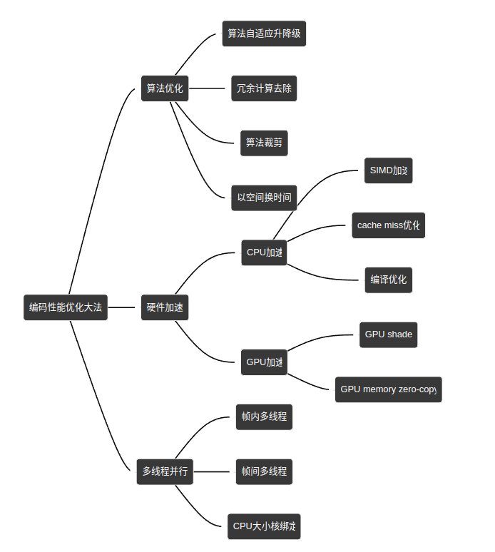
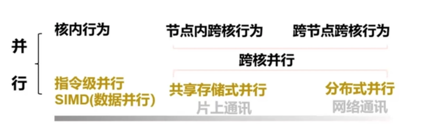

# 高性能计算

## roadmap
- https://www.zhihu.com/question/33576416
- https://heptagonhust.github.io/HPC-roadmap/
- HPC指南：https://github.com/l0ngc/hpc-learning
- 高等数值分析（高性能计算，并行计算）：https://math.ecnu.edu.cn/~jypan/Teaching/ParaComp/

## 代码优化
- 分支预测：https://blog.csdn.net/yaojingqingcheng/article/details/120913601
- simd优化：
  - 简单例子：https://blog.csdn.net/csdn546229768/article/details/128728780
  - https://blog.csdn.net/yaojingqingcheng/article/details/121616954
- 数据结构布局优化：https://blog.csdn.net/yaojingqingcheng/article/details/122418208
- 循环优化技术：输入值嵌入、分支消除、减少子过程调用次数、循环合并、子过程合并、改变循环变量的迭代顺序、改变数组维数、循环展开、循环分块（提高cache命中率，利用cache line） [video](https://www.bilibili.com/video/BV1Jm4y1k7Yz?p=1)
- 利用局部性原理
- CPU寄存器、内存、外存：优化缓存，如用restrict关键字说明指针间地址不存在关联。

## 并行编程
### 概念
- 指令并行：CPU流水线
- 分布式并行：MPI
- 共享存储式并行：OpenMP、OpenCL、OpenACC

### SIMD（Single Instruction Multi-Data）
- SIMD是CPU实现DLP（Data Level Parallelism）的关键
- SSE指令集（Streaming SIMD Extensions系列），使用XMM寄存器
- AVX指令集（Advanced Vector Extensions系列），使用YMM寄存器，相比SSE扩充浮点
- 优点：更高速的计算方法
- 缺点：更高的开发复杂度，专用的CPU组件

### SIMT（Single Instruction Multi-Threads）
#### CUDA/ROCM
- CUDA：NIDIA
- ROCM：AMD
#### OpenMP（Open Multi-Processing）
- 高性能计算入门：OpenMP并行编程技术（一）:https://www.bilibili.com/video/BV1ss4y1K7q1?p=1
- OpenMP模式：fork-join，是针对CPU的并行编程模型
- 硬件内存模型：
  - CPU在主存上有L1、L2、L3多级缓存
  - L3为多核共有，但L1和L2为每个核心私有，所以存在缓存一致性问题（False Sharing）

#### OpenCL（Open Computing Language）
- 跨平台
- 基于C/C++语言

#### OpenACC
- 编译器：pgcc
- 针对GPU，OpenMP模型在GPU上的扩展

### MPI
MPI，Message Passing Interface，消息传递接口，主要用于进程间的消息传递（或数据传递）
- 是一种库描述，不是语言
- 是一种标准或规范，不是具体的实现（如Intel MPI，OpenMPI等）
- 是一种消息传递编程模型，并成为这种编程模型的代表和事实上的标准。
- 并行效率不降反增（加速比下降）：负载不均衡、并行粒度的选择
- MPI四类通讯模式
- 逻辑进程排列：MPI虚拟进程拓扑

## 性能分析
### 程序流程分析
- 静态分析：即对代码进行数据对象、函数接口封装和调用分析，工具understand
- 动态分析：即程序实际调用过程中分析执行的函数及流程，工具gprof

## 参考
- C进阶：https://www.bookstack.cn/read/whyilearnc/README.md
- 中科大超算中心资料手册：https://scc.ustc.edu.cn/zlsc/
